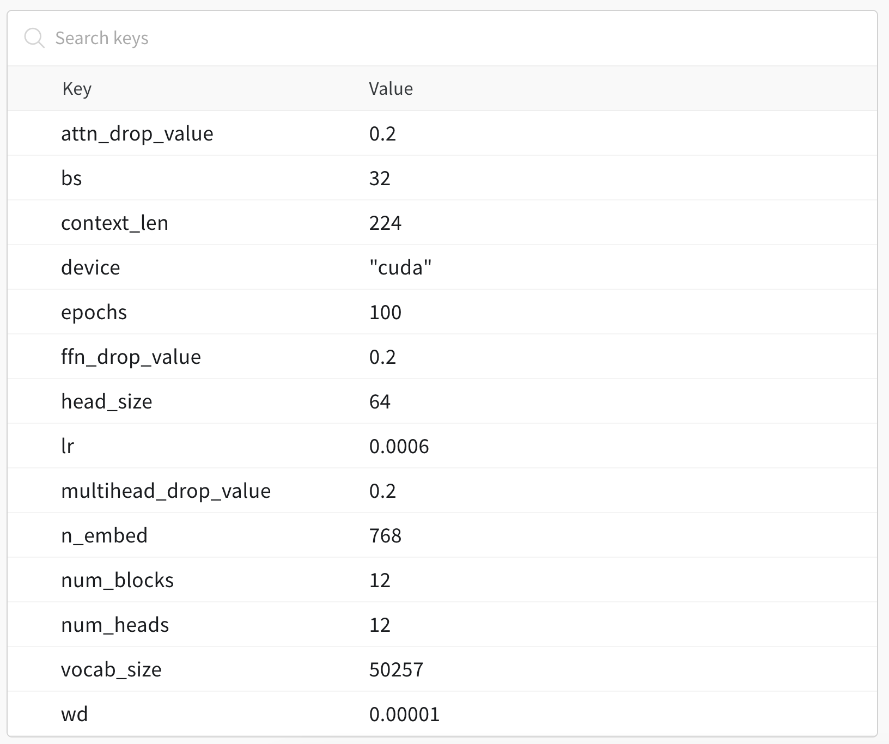

# GPT Pre-training from Scratch


Live training version with PyTorch lightning [here](https://www.kaggle.com/code/heyytanay/pytorch-lightning-gpt-pre-training-w-b) ⚡️

This repository is my attempt on writing a GPT model and pre-training it from scratch on data openly found on the internet, in this case – the [Bookcorpus dataset](https://www.kaggle.com/datasets/krishbaisoya/english-bookcorpus) on Kaggle.

I have currently only trained the model on a very small subset of this data because of resource constraints and because of my decision to see how good of a model one can train for free with only his/her skills.

I wrote the GPT model from scratch with a lot of inspiration and help form Andrej Karpathy's [nanoGPT](https://github.com/karpathy/nanoGPT). Huge shoutout and thanks to his work in educating millions about these LLMs.

In this README, you will find several notes on model architecture, data tokenization, data loading and in-general model training.

I am currently in the process of writing a blog post where I will have detailed several approaches on how to train the model and load data efficiently as well as my observations while doing this.

## Understanding the code
Following are the contents of the files in this repository:
* `config.py`: Config class, I decided to put it into a Python file instead of a JSON file, because why not. This file does not import any other file in the source but almost all other file imports it.
* `model.py`: Model file housing the different classes (such as `FFN`, `MultiHeadedAttention`, etc). It also has the function like `generate()` which will be used to generate new text. `GPT` class can be imported from this file which will be trained.
* `prepare_data.py`: This file is used to take the raw `.txt` file of text and tokenize it using `GPT2TokenizerFast` and then dump files with a specified number of lines of tokenized text on the disk. For example, if you specify number of lines to be `500,000` and number of files to be `50`, that script will start reading the lines from the text file (dataset) and tokenize each line. After every 500K lines, it will save that one big tokenized file to the disk using `torch.save()`. It will do that until all 50 files have been saved.
* `process_data.py`: Despite how the file is named, this file has the custom data sampler as well as the dataset class responsible for loading the said tokenized data files while training. More on this in the "Notes on Data Loading" section below.
* `train.py`: This is the main file you will run. It will be responsible for loading the initialising the model and loading an existing state_dict of a model checkpoint (if you have any). This imports all the above files except the prepare_data file which is more like a standalone utility.

## Notes on Data Loading
For data, I am using scifi-stories-text-corpus dataset. The dataset consists of one large .txt file which has all the text in one line. Although I am loading all of it, I am only using 1/3 of the dataset in my notebook (for memory reasons).

For dataloading, I have defined a Customized RandomSampler that will only give indexes to the PyTorch dataloader that will not throw torch.stack errors when an index is near the end of the file.

In the Dataset class, instead of tokenizing the entire text dataset again and again (which will not only be painfully slow but also very very memory expensive), I am pre-selecting the window of the text relevant to us and then only tokenizing that. In principal, that will always be the length of $context\_len+1$ (for example, tokenizing 16+1=17 tokens, instead of all 8 Million tokens!).

Hopefully this inspires people to write better dataloading strategies!

## Training the model
Once you have all your data in place and paths sorted out, just run the following to train the model:

```bash
$ python src/train.py
```

## Training Results
Below are the parameters and the loss graph of one of the model training runs.



As in the above image, the model was trained for 100 epochs.

Below is the loss graph for this run.


Final loss of this run was **4.22** .

Below is also a sample generation from this run.
In the below generation, I supplied my trained model with the prompt "In my opinion," and it generated everything else.

```diff
In my opinion,
+it is the world to me. Thank you.”
+Dr. Consumer Razfrey, a co-author who was inducted from physician and audience, was registered in the US on the board from a party after a $1,430.18-literature, which prompted the Congressional documents to send the Superior Committee of Socialist Socialist speaker.
+“We had the latest contact at the mortuary in 2010 – an answer. It was an doing that into helping thousands of people traveling and improving our internal politics changed the world, so that single person, not one of our leaders, would have achieved a slim Proport of systems by teachers. The board hopes that every class/cor semester of students passed a Genesis 2014 coinage (we shared this column). The math exclusion never sets out the goals, the whole system says.”
+As we have discussed above, both formal and informal – may appear useful in the question and throughout the semester – as those respondents got to work did to reflect the pallor and then make sure they wouldn’t make up their own subject. �
```